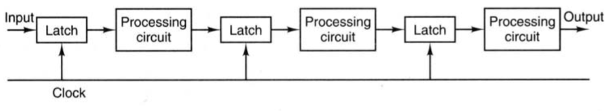

# Architechtures Parallele

## Intro

* Von Neumann (1946):
    1. Chargement DATA RAM -> Registre
    1. Decodage et MAJ Instruction Pointer
    1. Calcul de l'adresse de l'operande
    1. Chargement Operande RAM -> Registre
    1. Execution
    1. Calcul de l'adresse du resultat
    1. Stockage du resultat


* Code Inspection: 70% Operations

* Code Optimisation Priority:
    1. Complexity
    1. Templates/preprocessor
    1. PIPELINE (Operations)
    1. ...
    1. Parallelism

## Basic Operations

* Addition
    1. Denormalising
    2. Adding
    3. Normalising

* Floating point multiplication
    1. Adding exposant#translate
    1. Multipling mantisses
    1. Normalising

## I. [Pipeline](www2.cs.siu.edu/~cs401/Textbook/ch3.pdf) (Operateur Cablé)



* Decomposition to segments.
* Every segment theoretically have the same execution time.
* At each clock pulse, every stage transfers its intermediate result to the input of the next stage

* 2 Problems:
    * Injections rapprochées (Cas non ideal)
    * Dependances de données => multiple subprocesses acc1, acc2, acc3 ...
    * Indirect access (NO OPTIMISATION DONE BY THE CC)

## II. Superscalar Processor ([Loop unrolling](http://iris.nyit.edu/~bbehesht/EENG641_Resources/Chapter3/MN_Loop_Unrolling.pdf))

Sample1:

``` C
// NON OPTIMISED CODE
double accumulator(double* a, unsigned size) {
    double acc = 0;
    for (unsigned i = 0; i < size; i++) {
        acc += a[i];
    }
    return res
}

// Optimisation pipeline k is the number of pipeline depth min op to achieve the result
double accumulator(double* a, unsigned size) {
    double res[k];
    for (unsigned i = 0; i < size; i+=k) {
        res[0] += a[i];
        res[1] += a[i+1];
        res[2] += a[i+2];
        ...
        res[k] += a[i+k];
    }
    for (unsigned i = 1; i < k; i++) {
        res[0] += res[i]
    }
    return res[0];
}
```

* Collision Vector !?

Sample2:

``` C
// NON-OPTIMISED CODE
while (FAR FAR AWAY DEADLINE) {
    for (unsigned i = [0]; i != size; i++) {
        y[i] = a * x[[i]] + b[i];
    }
}
// PARALLELISM SUPERSCALAR SINGLE-CORE PIPELINE
while (FAR FAR AWAY DEADLINE) {
    y[0] = a * x[0];
    y[1] = a * x[1];
    for (unsigned i = 2; i != size; i+=2) {
        y[i-2] += b[i-2];
        y[i] = a * x[i];
    }
    y[n-1] += b[n-1];
}

```
