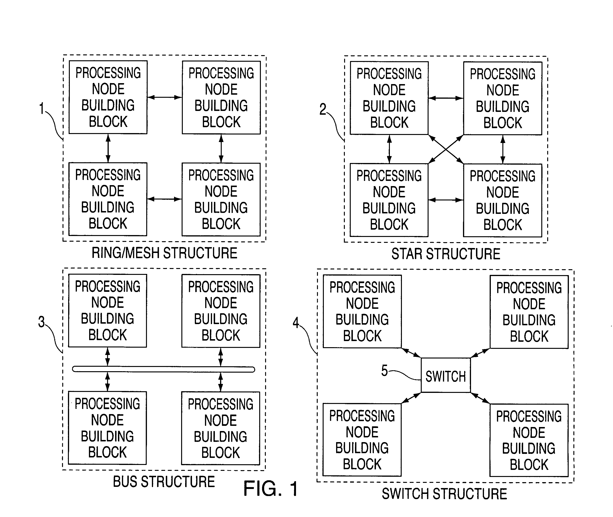
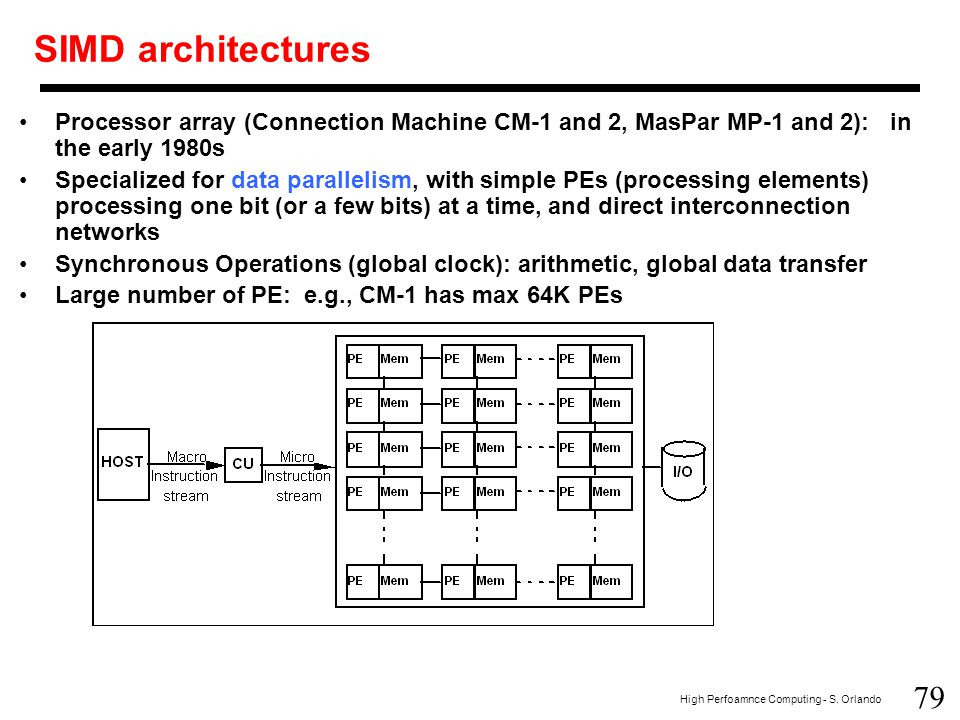

# Architectures Paralleles

## Biblio
* [High Performance Platforms](http://slideplayer.com/slide/4945068/)
* [System Design](https://www.slideshare.net/abshinde/system-on-chip-architectures)
* [Introduction to MIMD architectures](http://slideplayer.com/slide/4762170/)
* [Packet Switch Architectures Dr. Isaac Keslassy Electrical Engineering, Technion Scaling.](http://slideplayer.com/slide/5076446/)
* [Benes, Clos, and Fat Trees - Inverse Multiplexing ](http://users.ics.forth.gr/kateveni/534/04a/s52_benes.html)
[Cache coherence](https://www.slideshare.net/adeshmishra5/cache-coherence)
[Cache Coherence in Bus-Based Shared Memory Multiprocessors](http://slideplayer.com/slide/5338833/)
[Block Diagram Of Cache Memory](http://readingrat.net/block-diagram-of-cache-memory/)
[Mapping of one model into other model ](https://www.slideshare.net/ratikaagarwal/mapping-of-one-model-into-other-model)
[Parallel Processing, Implementation Aspects](http://slideplayer.com/slide/4072307/)
[NUMA-aware Scalable Graph Traversal on SGI UV Systems](https://www.slideshare.net/yuichiroyasui/numaaware-scalable-graph-traversal-on-sgi-uv-systems)
## Intro

* Von Neumann (1946):
    1. Chargement DATA RAM -> Registre
    1. Decodage et MAJ Instruction Pointer
    1. Calcul de l'adresse de l'operande
    1. Chargement Operande RAM -> Registre
    1. Execution
    1. Calcul de l'adresse du resultat
    1. Stockage du resultat


* Code Inspection: 70% Operations

* Code Optimisation Priority:
    1. Complexity
    1. Templates/preprocessor
    1. PIPELINE (Operations)
    1. Parallelism

## Basic Operations

* Addition
    1. Denormalising
    2. Adding
    3. Normalising

* Floating point multiplication
    1. Adding exposant#translate
    1. Multipling mantisses
    1. Normalising

## I. [Pipeline](www2.cs.siu.edu/~cs401/Textbook/ch3.pdf) (Operateur Cablé)


* Decomposition to segments.
* Every segment theoretically have the same execution time.
* At each clock pulse, every stage transfers its intermediate result to the input of the next stage

* 2 Problems:
    * Injections rapprochées (Cas non ideal)
    * Dependances de données => multiple subprocesses acc1, acc2, acc3 ...
    * Indirect access (NO OPTIMISATION DONE BY THE CC)

### Superscalar Processor ([Loop unrolling](http://iris.nyit.edu/~bbehesht/EENG641_Resources/Chapter3/MN_Loop_Unrolling.pdf))

Sample1:

``` C
// NON OPTIMISED CODE
double accumulator(double* a, unsigned size) {
    double acc = 0;
    for (unsigned i = 0; i < size; i++) {
        acc += a[i];
    }
    return res
}

// Optimisation pipeline k is the number of pipeline depth min op to achieve the result
double accumulator(double* a, unsigned size) {
    double res[k];
    for (unsigned i = 0; i < size; i+=k) {
        res[0] += a[i];
        res[1] += a[i+1];
        res[2] += a[i+2];
        ...
        res[k] += a[i+k];
    }
    for (unsigned i = 1; i < k; i++) {
        res[0] += res[i]
    }
    return res[0];
}
```

* Collision Vector !?

Sample2:

``` C
// NON-OPTIMISED CODE
while (FAR FAR AWAY DEADLINE) {
    for (unsigned i = [0]; i != size; i++) {
        y[i] = a * x[[i]] + b[i];
    }
}
// PARALLELISM SUPERSCALAR SINGLE-CORE PIPELINE
while (FAR FAR AWAY DEADLINE) {
    y[0] = a * x[0];
    y[1] = a * x[1];
    for (unsigned i = 2; i != size; i+=2) {
        y[i-2] += b[i-2];
        y[i] = a * x[i];
    }
    y[n-1] += b[n-1];
}

```

### What about memory! (Pipelining Memory Access)
* General work frequency is limited by the Memory Flush frequency
* Multiple Slots -> Pipelined Memory Access Requests -> Working with CPU frequency
* (MMU) Addressing Multiple slots suggests a Slot Id and a start offset
* High Order Interleaving: (Big Endian)   |ID|   offset    |
* Low Order Interleaving: (Little Endian) |    offset   |ID|
* Cycled Variables Repartition In slots
* Optimisation: manual memory management depending on the language: C, Fortran
* /!\ Cache Handling!

## II. Parallelism

* Au moins 2 processeurs (Processeurs Elementaires - PE)
* Barres Memoires
* Reseau d'interconnexion (RSO)



* #### Parallele VS Distribue
    * paralelle: ensemble de PE qui operent sur la resolution d'un prob de grande taille -> Calcul Matriciel/tensoriel...
    * distribue: ensemble de processeurs autonomes qui operent par echange de messages via un RSO de communication

* #### Super Calculateur
    * paralleles (des Milliers de PE)
    * vectoriels (single-core pipeline)

### 1. Classe de Machines paralelles
#### a. Par modeles d'execution:
Le plus simple (Flyin 1972): Flots d'Instructions ou du Data soit Simple ou Multiple. donc 4 classes de modeles: *SISD SIMD MISD MIMD*

* Single Instruction Single Data: Von Neumann!


* Single Instruction Multiple Data: Synchrone!


    Exemple: MASPAR (DIGITAL) 1990

* Multiple Instruction Single Data: rare, peu d'applications, pas de représentant connu!


* Multiple Instruction Multiple Data: Asynchrone! independance des PE!


* GPU.. Single Program Multiple Data.


#### b. Par structure de memoire
3 structures majeurs:

##### Memoire partagee (1980 ~ 1990): Dynamique
* non bloquant (switch)
* rearengeable (switch using VLAN)
* bloquant


##### Rq:
###### *switch structure*
* Crossbar network:


* CLOS network:
  

  

  

* [Facebook Shares Open Networking Switch Design, Part of its Next Gen Networking](https://horovits.wordpress.com/2015/02/15/facebook-shares-open-switch-next-gen-networking-design/)
  

###### Memory coherence


##### Memoire distribuee (1990 ~ 2000)


###### Topologies:
* Mesh, tree, array


* Hypercube:


* History


* connection machine


##### SMP ou Cluster de SMP (2000)


