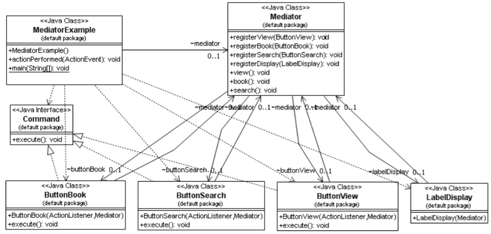

# Gang of Four Design Patterns

## Biblio
* Element of reusable object oriented software — 1995
* GoF Design Patterns - with examples using Java and UML2 — 2008

## All design patterns

  

* #### Abstract Factory
  Provide an interface for creating families of related or dependent objects without specifying their concrete classes.
* #### Adapter
  Convert the interface of a class into another interface clients expect. Adapter lets classes work together that couldn't otherwise because of incompatible interfaces.
* #### Bridge
  Decouple an abstraction from its implementation so that the two can vary independently.
* #### Builder
  Separate the construction of a complex object from its representation so that the same construction process can create different representations.
* #### Chain of Responsibility
  Avoid coupling the sender of a request to its receiver by giving more than one object a chance to handle the request. Chain the receiving objects and pass the request along the chain until an object handles it.
* #### Command
  Encapsulate a request as an object, thereby letting you parameterize clients with different requests, queue or log requests, and support undoable operations.
* #### Composite
  Compose objects into tree structures to represent part-whole hierarchies. Composite lets clients treat individual objects and compositions of objects uniformly.
* #### Decorator
  Attach additional responsibilities to an object dynamically. Decorators provide a flexible alternative to subclassing for extending functionality.
* #### Facade
  Provide a unified interface to a set of interfaces in a subsystem. Facade defines a higher-level interface that makes the subsystem easier to use.
* #### Factory Method
  Define an interface for creating an object, but let subclasses decide which class to instantiate. Factory Method lets a class defer instantiation 19 to subclasses.
* #### Flyweight
  Use sharing to support large numbers of fine-grained objects efficiently.
* #### Interpreter
  Given a language, define a represention for its grammar along with an interpreter that uses the representation to interpret sentences in the language.
* #### Iterator
  Provide a way to access the elements of an aggregate object sequentially without exposing its underlying representation.
* #### Mediator
  Define an object that encapsulates how a set of objects interact. Mediator promotes loose coupling by keeping objects from referring to each other explicitly, and it lets you vary their interaction independently.
* #### Memento
  Without violating encapsulation, capture and externalize an object's internal state so that the object can be restored to this state later.
* #### Observer
  Define a one-to-many dependency between objects so that when one object changes state, all its dependents are notified and updated automatically.
* #### Prototype
  Specify the kinds of objects to create using a prototypical instance, and create new objects by copying this prototype.
* #### Proxy
  Provide a surrogate or placeholder for another object to control access to it.
* #### Singleton
  Ensure a class only has one instance, and provide a global point of access to it.
* #### State
  Allow an object to alter its behavior when its internal state changes. The object will appear to change its class.
* #### Strategy
  Define a family of algorithms, encapsulate each one, and make them interchangeable. Strategy lets the algorithm vary independently from clients that use it.
* #### Template Method
  Define the skeleton of an algorithm in an operation, deferring some steps to subclasses. Template Method lets subclasses redefine certain steps of an algorithm without changing the algorithm's structure.
* #### Visitor
  Represent an operation to be performed on the elements of an object structure. Visitor lets you define a new operation without changing the classes of the elements on which it operates.

## I. Creational Design Datterns

* Creational design patterns are design patterns that deal with object creation mechanisms, trying to create objects in a manner suitable to the situation.
* The basic form of object
creation could result in design problems or added complexity to the design.
* Creational design patterns solve this problem by somehow controlling this object creation.

### 1. Factory Pattern

* #### Definition

  The Factory pattern provides a way to use an instance as a object factory. The factory can return an instance of one of several possible classes (in a subclass hierarchy), depending on the data provided to it.

* #### Where to use

  * When a class can't anticipate which kind of class of object it must create.
  * You want to localize the knowledge of which class gets created.
  * When you have classes that is derived from the same subclasses, or they may in fact be unrelated classes that just share the same interface. Either way, the methods in these class instances are the same and can be used interchangeably.
  * When you want to insulate the client from the actual type that is being instantiated.

* #### Benefits

  * The client does not need to know every subclass of objects it must create. It only need one reference to the abstract class/interface and the factory object.
  * The factory encapsulate the creation of objects. This can be useful if the creation process is very complex.

* #### Drawbacks/consequences

  * There is no way to change an implementing class without a recompile.

* #### Structure

  

* #### Usage
  The Connection object in the java package sql is a factory.
  Depending on the database driver you use you get the database vendors implementation of the Statement interface. In the following example we actually get an OracleStatement object from the package oracle.jdbc.driver when calling createStatement.

  

### 2. Abstract Factory Pattern

* #### Definition

  * The Abstract Factory pattern is a creational pattern which is related to the Factory Method pattern, but it adds another level of abstraction.
  What this means is that the pattern encapsulates a group of individual concrete factory classes (as opposed to concrete factory methods which are derived in subclasses) which share common interfaces.
  * The client software uses the Abstract Factory which provides an interface for creating families of related or dependent objects without specifying their concrete classes.
  * This pattern separates the implementation details of a set of objects from its general usage.

* #### Where to use

  * The pattern can be used where we need to create sets of objects that share a common theme and where the client only needs to know how to handle the abstract equivalence of these objects, i.e. the implementation is not important for the client.
  * The Abstract Factory is often employed when there is a need to use different sets of objects and where the objects could be added or changed some time during the lifetime of an application.

* #### Benefits

  Use of this pattern makes it possible to interchange concrete classes without changing the code that uses them, even at runtime.

* #### Drawbacks/consequences

  As with similar design patterns, one of the main drawbacks is the possibility of unnecessary complexity and extra work in the initial writing of the code.

* #### Structure

  

* #### Example

  * For instance, we could have an abstract class ***InsuranceCreator*** that provides interfaces to create a number of products (e.g. **createCarInsurance()**, **createHomeInsurance()**, **createPersonalInsurance()**).

  * Any number of derived concrete classes of the ***InsuranceCreator*** class can be created, for example ***CheapInsuranceCreator***, ***ExpensiveInsuranceCreator*** or ***ScamInsuranceCreator***, each with a different implementation of **createCarInsurance()**, **createHomeInsurance()** and **createPersonalInsurance()** that would create a corresponding object like *CheapCarInsurance*, *ExpensiveHomeInsurance* or *ScamPersonalInsurance*.

  * Each of these products is derived from a simple abstract class like ***CarInsurance***, ***HomeInsurance*** or ***PersonalInsurance*** of which the client is aware.

  * The client code would get an appropriate instantiation of the ***InsuranceCreator*** and call its factory methods.

  * Each of the resulting objects would be created from the same ***InsuranceCreator*** implementation and would share a common theme (they would all be cheap, expensive or scam objects).

  * The client would need to know how to handle only the abstract ***CarInsurance***, ***HomeInsurance*** or ***PersonalInsurance*** class, not the specific version that it got from the concrete factory.

### 3. Builder Pattern

* #### Definition

  * The Builder pattern can be used to ease the construction of a complex object from simple objects.
  * The Builder pattern also separates the construction of a complex object from its representation so that the same construction process can be used to create another composition of objects.
  * Related patterns include Abstract Factory and Composite.

* #### Where to use

  * When the algorithm for creating a complex object should be independent of the parts that make up the object and how they are assembled.
  * When the construction process must allow different representations for the object that is constructed.
  * When you want to insulate clients from the knowledge of the actual creation process and/or resulting product.

* #### Benefits

  * The built object is shielded from the details of its construction.
  * Code for construction is isolated from code for representation and both are easy to replace without affecting the other.
  * Gives you control over the construction process.
  * Gives you the possibility to reuse and/or change the process and/or product independently.

* #### Drawbacks/consequences

  * Need flexibility in creating various complex objects.
  * Need to create complex, aggregate objects

* #### Structure
  

  In the class diagram above:
  * The Builder specifies an abstract interface for creating parts of a Product.
  * The ConcreteBuilder constructs and assembles parts of the product by implementing the Builder interface.
  * The Director constructs an object using the Builder interface.
  * The Product represents the object under construction.

* #### Example
  * For instance to build a house, we will take several steps:
    1. Build floor
    1. Build walls
    1. Build roof
  * Let's use an abstract class ***HouseBuilder*** to define these three steps.
  * Any subclass of ***HouseBuilder*** will follow these three steps to build house (that is to say to implement these three methods in the subclass).
  * Then we use a ***HouseDirector*** class to force the order of these three steps (that is to say that we have to build walls after finished building floor and before building roof).
  * The ***HouseClient*** orders the building of two houses, one wood house and one brick house.
  * Even though the houses are of different types (wood and brick) they are built the same way, The construction process allows different representations for the object that is constructed.

* #### Usage
  Some examples of using the Builder pattern in knowledge engineering include different generators. Parsers in various compilers are also designed using the Builder pattern.

### 4. Prototype Pattern

* #### Definition

  * The Prototype pattern is basically the creation of new instances through cloning existing instances.
  * By creating a prototype, new objects are created by copying this prototype.

* #### Where to use

  * When a system needs to be independent of how its objects are created, composed, and represented.
  * When adding and removing objects at runtime.
  * When specifying new objects by changing an existing objects structure.
  * When configuring an application with classes dynamically.
  * When keeping trying to keep the number of classes in a system to a minimum.
  * When state population is an expensive or exclusive process.

* #### Benefits

  * Speeds up instantiation of large, dynamically loaded classes.
  * Reduced subclassing.

* #### Drawbacks/consequences

  * Each subclass of Prototype must implement the Clone operation.
  * Could be difficult with existing classes with internal objects with circular references or which does not support copying.

* #### Structure

  

  In the class-diagram above:
  * Prototype declares an interface for cloning itself.
  * ***ConcretePrototype*** implements an operation for cloning itself.
  * Client creates a new object by asking a prototype to clone itself.
  * You could use a ***PrototypeManager*** to keep track on the different types of prototypes.
  * The ***PrototypeManager*** maintains a list of clone types and their keys.
  * The client, instead of writing code that invokes the "*new*" operator on a hard-wired class name, calls the **clone()** method on the prototype.

* #### Usage
  If you are designing a system for performing bank account transactions, then you would want to make a copy of the Object which holds your account information, perform transactions on it, and then replace the original Object with the modified one. In such cases, you would want to use clone() instead of new.

### 5. Singleton Pattern

* #### Definition

  * The Singleton pattern provides the possibility to control the number of instances (mostly one) that are allowed to be made.
  * We also receive a global point of access to it (them).

* #### Where to use

  * When only one instance or a specific number of instances of a class are allowed.
  * Facade objects are often Singletons because only one Facade object is required.

* #### Benefits

  * Controlled access to unique instance.
  * Reduced name space.
  * Allows refinement of operations and representations.

* #### Drawbacks/consequences

  * Singleton pattern is also considered an anti-pattern by some people, who feel that it is overused, introducing unnecessary limitations in situations where a sole instance of a class is not actually required.

* #### Structure

  

## II. Structural Design Patterns

* Structural Patterns describe how objects and classes can be combined to form structures.
* We distinguish between object patterns and class patterns.
* The difference is that class patterns describe relationships and structures with the help of inheritance.
* Object patterns, on other hand, describe how objects can be associated and aggregated to form larger, more complex structures.

### 1. Adapter or Wrapper Pattern (cast)

* #### Definition

  * The Adapter pattern is used to translate the interface of one class into another interface.
  * This means that we can make classes work together that couldn't otherwise because of incompatible interfaces.
  * A class adapter uses multiple inheritance (by extending one class and/or implementing one or more classes) to adapt one interface to another.
  * An object adapter relies on object aggregation.

* #### Where to use

  * When you want to use an existing class, and its interface does not match the one you need.
  * When you want to create a reusable class that cooperates with unrelated or unforeseen classes, that is, classes that don't necessarily have compatible interfaces.
  * When you want to increase transparency of classes.
  * When you want to make a pluggable kit.

* #### Benefits

  * Highly class reusable.
  * Introduces only one object

* #### Drawbacks/consequences

  * When using Java, Target must be an interface.

* #### Structure

  

  In the class-diagram above:
  * A Client class expects a certain interface (called the Target interface)  
  * An available interface doesn't match the Target interface
  * An Adapter class bridges the gap between the Target interface and the available interface
  * The available interface is called the Adaptee

* #### Small example
  * Imagine you need to develop a simple file manager to handle text documents.
  * There is an existing resource that already handles this, but by some reason you are forced to a specific interface for your file manager.
  * By using a class adapter we can use the forced interface and still reuse the existing functionality.
  * In the class diagram below the interface FileManager is the target (desired interface).
  * FileManagerUtil is the existing utility class that we would like to adapt to FileManager interface. We do the actual adaptation in the class FileManagerImpl, this class uses the desired interface and the existing functionality through inheritance, i.e. a class adapter.

### 2. Bridge Pattern

* #### Definition
  * Decouple an abstraction or interface from its implementation so that the two can vary independently.
  * Bridge makes a clear-cut between abstraction and implementation.

* #### Where to use
  * When you want to separate the abstract structure and its concrete implementation.
  * When you want to share an implementation among multiple objects,
  * When you want to reuse existing resources in an 'easy to extend' fashion.
  * When you want to hide implementation details from clients.
  * Changes in implementation should have no impact on clients.

* #### Benefits
  * Implementation can be selected or switched at run-time.
  * The abstraction and implementation can be independently extended or composed.

* #### Drawbacks/consequences
  * Double indirection - In the example, methods are implemented by subclasses of DrawingAPI class.
  * Shape class must delegate the message to a DrawingAPI subclass which implements the appropriate method.
  * This will have a slight impact on performance.

* #### Structure

  

  In the class-diagram above:
  * Abstraction defines the abstract interface and maintains the Implementor reference.
  * Refined Abstraction extends the interface defined by Abstraction.
  * Implementor defines the interface for implementation classes.
  * ConcreteImplementor implements the Implementor interface.

### 3. Composite Pattern

* #### Definition
  * The Composite pattern helps you to create tree structures of objects without the need to force clients to differentiate between branches and leaves regarding usage.
  * The Composite pattern lets clients treat individual objects and compositions of objects uniformly.

* #### Where to use

  * When you want to represent a part-whole relationship in a tree structure.
  * When you want clients to be able to ignore the differences between compositions of objects and individual objects.
  * When the structure can have any level of complexity and is dynamic.

* #### Benefits

  * Define class hierarchies consisting of primitive objects and composite objects.
  * Makes it easier to add new kind of components.

* #### Drawbacks/consequences

  * The Composite pattern makes it easy for you to add new kinds of components to your collection as long as they support a similar programming interface.
  * On the other hand, this has the disadvantage of making your system overly general.
  * You might find it harder to restrict certain classes where this would normally be desirable.

* #### Structure

  

  In the class-diagram above,
  * Component:
    * is the abstraction for all components, including composite ones,
    * declares the interface for objects in the composition,
    * implements default behavior for the interface common to all classes, as appropriate,
    * declares an interface for accessing and managing its child components, and
    * (optional) defines an interface for accessing a component's parent in the recursive structure, and implements it if that's appropriate.
  * Leaf:
    * represents leaf objects in the composition, and •implements all Component methods.
  * Composite:
    * represents a composite Component (component having children),
    * implements methods to manipulate children, and
    * implements all Component methods, generally by delegating them to its children.

### 4. Decorator Pattern

* #### Definition

  * The Decorator pattern lets you attach additional responsibilities and modify an instance functionality dynamically.
  * Decorators provide a flexible alternative to subclassing for extending functionality, using composition instead of inheritance.

* #### Where to use

  * When you want to add responsibilities to individual objects dynamically and transparently, without affecting the original object or other objects.
  * When you want to add responsibilities to the object that you might want to change in the future.
  * When extension by static subclassing is impractical.

* #### Benefits

  * More flexibility than static inheritance.
  * Avoids feature-laden classes high up in the hierarchy.
  * Simplifies coding because you write a series of classes each targeted at a specific part of the functionality rather than
  * coding all behavior into the object.
  * Enhances the object's extensibility because you make changes by coding new classes.

* #### Drawbacks/consequences

  * One thing to keep in mind when implementing the Decorator pattern is that you need to keep the component interface simple.
  * You want to avoid making the component interface overly complex, because a complex interface will make it that much harder to get each decorator right.
  * Another potential drawback of the Decorator pattern is the performance overhead associated with a long chain of decorators.

* #### Structure

  

### 5. Facade Pattern

* #### Definition

  * This design pattern provides a unified interface to a set of interfaces in a subsystem.
  * It defines a higher-level interface that makes the subsystem easier to use.
  * A facade is an object that provides a simplified interface to a larger body of code, such as a class library.

* #### Where to use

  * The Facade can be used to make a software library easier to use and understand, since the Facade has convenient methods for common tasks.
  * For the same reason, it can make code that uses the library more readable.
  * The pattern can also be used to reduce dependencies of outside code on the inner workings of a library, since most code uses the Facade it allows more flexibility when developing the system.
  * A final usage scenario is where we can wrap several poorly-designed APIs with a single well-designed API.

* #### Benefits

  * The main benefit with the Facade pattern is that we can combine very complex method calls and code blocks into a single method that performs a complex and recurring task.
  * Besides making code easier to use and understand, it reduces code dependencies between libraries or packages, making programmers more apt to consideration before writing new code that exposes the inner workings of a library or a package.
  * Also, since the Facade makes a weak coupling between the client code and other packages or libraries it allows us vary the internal components since the client does not call them directly.

* #### Drawbacks/consequences
  * One drawback is that we have much less control of what goes on beyond the surface.
  * Also, if some classes require small variations to the implementation of Facade methods, we might end up with a mess.

* #### Structure

  

  * Consider the graphics above, where the Client classes makes calls to the BankAccountFacade class.
  * The Facade class uses the classes AccountManager, SecurityManager, AccountReference and BankAccount to perform the appropriate actions.
  * By using the Facade pattern we decouple the client code from the implementation and security details when performing tasks related to the bank account.

### 6. Flyweight Pattern

* #### Definition

  * The Flyweight pattern provides a mechanism by which you can avoid creating a large number of 'expensive' objects and instead reuse existing instances to represent new ones.

* #### Where to use

  * When there is a very large number of objects that may not fit in memory.
  * When most of an objects state can be stored on disk or calculated at runtime.
  * When there are groups of objects that share state.
  * When the remaining state can be factored into a much smaller number of objects with shared state.

* #### Benefits

  * Reduce the number of objects created, decrease memory footprint and increase performance.

* #### Drawbacks/consequences

  * Designing objects down to the lowest levels of system "granularity" provides optimal flexibility, but can be unacceptably expensive in terms of performance and memory usage.

* #### Structure

  

### 7. Proxy Pattern

* #### Definition

  * A Proxy is a structural pattern that provides a stand-in for another object in order to control access to it.

* #### Where to use

  * When the creation of one object is relatively expensive it can be a good idea to replace it with a proxy that can make sure that instantiation of the expensive object is kept to a minimum.
  * Proxy pattern implementation allows for login and authority checking before one reaches the actual object that's requested.
  * Can provide a local representation for an object in a remote location.

* #### Benefits

  * Gives the ability to control access to an object, whether it's because of a costly creation process of that object or security issues.

* #### Drawbacks/consequences

  * Introduces another abstraction level for an object, if some objects accesses the target object directly and another via the proxy there is a chance that they get different behavior this may or may not be the intention of the creator.

## III. Behavioral Design Patterns

* Behavioral patterns are patterns that focuses on the interactions between cooperating objects.
* The interactions between cooperating objects should be such that they are communicating while maintaining as loose coupling as possible.
* The loose coupling is the key to n-tier architectures.
* In this, the implementation and the client should be loosely coupled in order to avoid hard-coding and dependencies.

### 1. Chain-of-responsibility Pattern

* #### Definition

  * The Chain-of-responsibility pattern lets more than one object handle a request without mutual knowledge.
  * We avoid coupling between the sender of a request and the possible receivers.
  * We place all receivers in a chain which lets the receiving objects pass the request along to the next receiver in the chain until one receiver handles it, or the end of the chain is reached.

* #### Where to use

  * When more than one object may handle a request, and the handler isn't known.
  * When you want to issue a request to one of several objects without specifying the receiver explicitly.
  * When the set of objects that can handle a request should be specified dynamically.

* #### Benefits

  * It reduces coupling.
  * It increases the flexibility of handling a request.

* #### Drawbacks/consequences
  * Reception isn't guaranteed since a request has no explicit receiver, there's no guarantee it will be handled unless the chain is configured properly.

* #### Structure

  

### 2. Command Pattern

* #### Definition

  * The Command pattern is used to create objects that represents actions and events in an application.
  * A command object encapsulates an action or event and contains all information required to understand exactly what has happened.
  * By passing the command object as a parameter we can, anywhere needed extract information about occurred actions and events.

* #### Where to use

  * Where you want a action that can be represented in many ways, like drop- down menu, buttons and popup menu.
  * To create undo/redo functionality.

* #### Benefits

  * A command object is a possible storage for procedure parameters. It can be used while assembling the parameters for a function call and allows the command to be set aside for later use.
  * A class is a suitable place to collect code and data related to a specific action or event.
  * It allows the reaction to a command to be executed some time after it has occurred.
  * Command objects enables data structures containing multiple commands.
  * Command objects supports undo-able operations, provided that the command objects are stored (for example in a linked list).

* #### Drawbacks/consequences

  * The main disadvantage of the Command pattern seems to be a proliferation of little classes that clutter up the program.
  * However, even in the case where we have separate click events, we usually call little private methods to carry out the actual function.
  * It turns out that these private methods are just about as long as our little classes, so there is frequently little difference in complexity between building the Command classes and just writing more methods.
  * The main difference is that the Command pattern produces little classes that are much more readable.

* #### Structure

  

### 3. Iterator Pattern

* #### Definition

  * The Iterator design pattern provides a way to access the elements of an aggregate object sequentially without exposing its underlying representation.

* #### Where to use

  * Use to access the elements of an aggregate object sequentially.

* #### Benefits

  * The same iterator can be used for different aggregates.
  * Allows you to traverse the aggregate in different ways depending on your needs.
  * It encapsulates the internal structure of how the iteration occurs.
  * Don't need to bloat the your class with operations for different traversals.

* #### Drawbacks/consequences

  * Not thread safe unless its a robust iterator that allows insertions and deletions.
  * This can be be solved by letting the Iterator use a Memento to capture the state of an iteration.

* #### Structure

  

### 4. Mediator Pattern

* #### Definition

  * With the mediator pattern communication between objects is encapsulated with a mediator object.
  * Objects no longer communicate directly with each other, but instead communicate through the mediator.
  * This results in a more cohesive implementation of the logic and decreased coupling between the other objects.

* #### Where to use

  * The Mediator pattern can be used when a set of objects communicate in well-specified but complex ways and the resulting interdependencies are unstructured and hard to grasp.
  * If it is difficult to reuse an object because it refers to and communicates with many other objects this pattern is a good solution.
  * Communicating object's identities will be protected when using the Mediator pattern which is good when security is important.
  * Also, if you like to customize some behavior which is spread out between several classes without a lot of subclassing this pattern should be applied.
  * The pattern is used in many modern systems that reflect a send/receive protocol, such as list servers and chat rooms.
  * Another area of use is graphical user interfaces, where the mediator can encapsulate a collective behavior to control and coordinate the interactions of a group of GUI widgets.
  * The mediator serves as an intermediary that keeps objects in the group from referring to each other explicitly.
  * The objects only know the mediator which reduces the number of interconnections.

* #### Benefits

  The Mediator pattern has five benefits and drawbacks:
    1. ###### Limited subclassing,
    since a mediator localizes behavior that otherwise would be distributed among several objects.
    Changing some behavior requires us to subclass only the mediator.

    2. ###### Colleagues become decoupled
    which allows us to vary and reuse colleague and mediator classes independently.

    3. ###### A mediator simplifies object protocols
    since it replaces  many-to-many interactions with one-to-many interactions between the mediator and its colleagues.
    One-to-many interactions are easier to understand, maintain, and extend.

    4. ###### The mediator abstracts object cooperation.
    The mediator lets you focus on how objects interact apart from their individual behaviors which can help clarify how objects interact in a system.

    5. ###### Centralized control is achieved
    by trading complexity of interaction for complexity in the mediator.
    A mediator encapsulates protocols and can become more complex than any individual colleague.
    This can make the mediator itself a very complex and large piece of code that is hard to maintain.

* #### Drawbacks/consequences

  * Besides the benefits and drawbacks described above, one important drawback is that the Mediator pattern can have a performance impact on a system.
  * Since all communication must go through the mediator, it can become a bottleneck.

* #### Structure

  

### 5. Memento Pattern

* #### Definition

  * To record an object internal state without violating encapsulation and reclaim it later without knowledge of the original object.
  * A memento is an object that stores a snapshot of the internal state of another object.

* #### Where to use

  * When letting some info in an object be available by another object.
  * When you want to create snapshots of a state for an object.
  * When you need undo/redo features.

* #### Benefits

  * Ability to restore an object to its previous state.

* #### Drawbacks/consequences

  * Care should be taken if the originator may change other objects or resources - the memento pattern operates on a single object.
  * Using memento to store large amounts of data from Originator might be expensive if clients create and return mementos frequently.

* #### Structure

  

  In the class-diagram above:
  * An instance from the Originator class is the object that knows how to save itself. Uses memento to restore itself.
  * An instance from the Caretaker class is the object that knows why and when the Originator needs to save and restore itself. Never operates or examines the contents of memento
  * An instance of the Memento class is the lock box that is written and read by the Originator, and shepherded by the Caretaker.

    The originator is any object that has an internal state, that we want to take a snapshot of. The caretaker is going to do something to the originators state, but wants to be able to later restore the originators state. The caretaker first asks the originator for a memento object, containing the snapshot. Then it performs the sequence of operations it was going to do. To roll back to the state before the operations, it returns the memento object to the originator.

### 6. Observer Pattern

* #### Definition

  * An observer is a structural pattern that enables publish/subscribe functionality.
  * This is accomplished by an autonomous object, publisher that allows other objects to attach or detach their subscription as they like.
  * The pattern does not impose any limit to the number of observers that can attach, or subscribe, themselves for notification on future changes in the publisher's state.

* #### Where to use

  * When an object wants to publish information and many objects will need to receive that information.

* #### Benefits

  * Makes for a loose coupling between publisher and subscriber as the publisher does not need to know who or how many subscribers there will be.

* #### Drawbacks/consequences

  * In a complex scenario there may be problems to determining whether the update to the publisher is of relevance to all subscribers or just some of them.
  * Sending an update signal to all subscribers might impose a communication overhead of not needed information.

* #### Structure

  

### 7. State Pattern

* #### Definition

  * The State pattern allows an object to alter its behavior when its internal state changes.
  * By using inheritance and letting subclasses represent different states and functionality we can switch during runtime.
  * This is a clean way for an object to partially change its type at runtime.

* #### Where to use

  * When we need to define a "context" class to present a single interface to the outside world. By defining a State abstract base class.
  * When we want to represent different "states" of a state machine as derived classes of the State base class.

* #### Benefits

  * Cleaner code when each state is a class instead.
  * Use a class to represent a state, not a constant.

* #### Drawbacks/consequences

  * Generates a number of small class objects, but in the process, simplifies and clarifies the program.
  * Eliminates the necessity for a set of long, look-alike conditional statements scattered throughout the code.

* #### Structure

  

* #### Usage

  * Consider a drawing application with different tools like select, rectangle, circle, fill and clear.
  * Each one of the tool behaves different when you click or drag the mouse across the screen.
  * The state of the editor affects the behavior the program should exhibit.
  * There are some mouse activities which needs to be handled.

    

### 8. Strategy Pattern

* #### Definition

  * Use strategy when you need to define a family of algorithms, encapsulate each one, and make them interchangeable.
  * Strategy lets the algorithm vary independently from clients that use it.
  * Related patterns include **State**, **Flyweight**, **Decorator**, **Composite**.

* #### Where to use

  * When you need to use one of several algorithms dynamically.
  * When you want to configure a class with one of many related classes (behaviors).
  * When an algorithm uses data that clients shouldn't know about.

* #### Benefits

  * Reduces multiple conditional statements in a client.
  * Hides complex, algorithmic-specific data from the client.
  * Provides an alternative to subclassing.
  * Can be used to hide data that an algorithm uses that clients shouldn't know about.

* #### Drawbacks/consequences

  * Clients must be aware of different strategies.
  * A client must understand how strategies differ before it can select the appropriate one.
  * Increases the number of objects in an application.

* #### Structure

  

  In the class-diagram above:
  * The Strategy interface defines the behavior that is common to all the concrete implementations.
  * The ConcreteStrategy encapsulates an implementation of a specific algorithm or behavior that is defined through the Strategy interface.
  * The Context provides certain services that is defined by the Strategy interface and implemented by different ConcreteStrategy classes depending on behavior.

* #### Usage

  Sorting algorithms: Two sorting algorithms (Bubble sort and Quick sort) are implemented and the client can select either of the algorithms.
  * The ***SortInterface*** describes what the algorithms must be able to do, sort().
  * The classes **QuickSort** and **BubbleSort** both implements the ***SortInterface*** and each have their own algorithm for sorting.
  * ***SortingContext*** maintains a reference to a Strategy object and forwards client requests to the strategy.
  * ***SortingClient*** set the concrete strategy in the context and invokes the context to run the algorithm.

    
